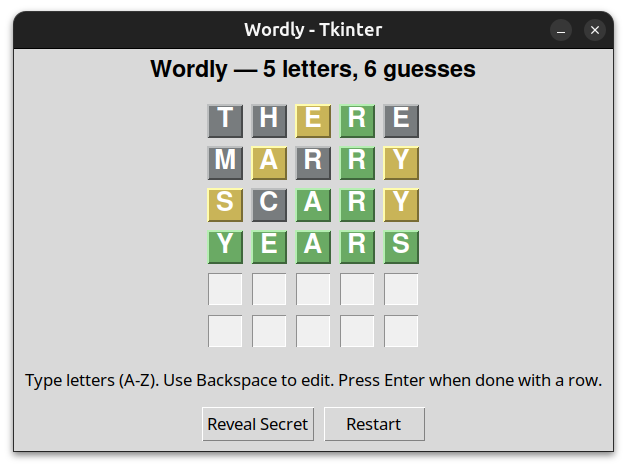

# Games 🎮

A collection of small games built with Python.

Currently includes:

## 1. Wordly ✍️

A **Wordle-style game** implemented in Python with a Tkinter GUI.

### Features

* Customizable number of letters and guesses
* Interactive grid-based interface
* Color-coded feedback:

  * 🟩 Green for correct letter + position
  * 🟨 Yellow for correct letter in wrong position
  * ⬛ Gray for incorrect letter
* Optionally allow a custom secret word (for testing)
* "Reveal Secret" button (ends the game immediately)
* Restart option after win/lose

## Clone this repository to get started

```bash
git clone https://github.com/DevadattaP/Games.git
```

### Requirements

* Python 3.8+
* Tkinter (comes pre-installed with most Python distributions)
* Install dependencies:

```bash
pip install -r requirements.txt
```

> [!NOTE]
> If you are on linux and don't have Tkinter, you can install it via your package manager. For example, on Debian/Ubuntu:
>
> ```bash
> sudo apt-get install python3-tk
> ```

### Run the game (Example for Wordly)

```bash
python wordly.py
```

---

## Screenshots

1. Wordly game:

 |

## Future Plans

This repository will grow into a **mini-game collection**, where each game lives in its own file/module. Planned games may include:

* Number guessing (binary search style)
* Finding birthday
* Finding erased number
* Hangman
* word guessing (type words, and you will know how near/far you are)
* Sudoku (both solver and generator)
* tic-tac-toe
* n-queens puzzle
* zip (like on LinkedIn)
* patches (like on LinkedIn)
* More puzzle/logic games

## Keep playing & Stay tuned 🚀
